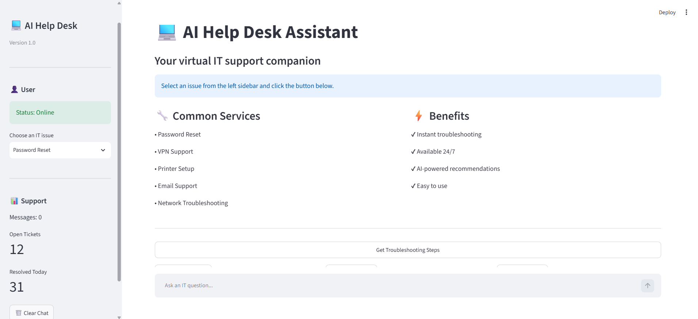

# 💻 AI Help Desk Assistant

An AI-powered IT support assistant designed to help users troubleshoot common technical issues quickly and efficiently.

## 🚀 Project Overview

The AI Help Desk Assistant is a web-based application built with Python and Streamlit.

The goal of this project is to demonstrate how Artificial Intelligence can improve IT support operations by providing instant troubleshooting guidance for common user problems.

## 🎯 Business Problem

Many organizations receive repetitive IT support requests:

- Password reset issues
- VPN connectivity problems
- Printer problems
- Email configuration issues
- Network connectivity problems

This project explores how AI can reduce support workload and improve response time.

## ✨ Features

Current features:

✅ Interactive web interface  
✅ IT issue selection menu  
✅ Automated troubleshooting responses  
✅ Simple and user-friendly design  

Future features:

🔄 AI chatbot integration  
🔄 Natural language understanding  
🔄 Knowledge base integration  
🔄 User feedback system  
🔄 Support ticket analytics  

## 🛠️ Technologies Used

| Technology | Purpose |
|---|---|
| Python | Application development |
| Streamlit | Web interface |
| Git/GitHub | Version control |
| OpenAI/Gemini/Groq API | AI capabilities (planned) |
## AI Provider

The application uses the **Groq API** for AI-powered responses.

The project was initially developed with the Gemini API. Due to API quota limitations during development, the AI integration was migrated to Groq with minimal architectural changes.

## 📂 Project Structure

[AI-HelpDesk-Assistant/

│
├── app.py
├── requirements.txt
├── README.md
├── .gitignore
│
├── assets/
├── data/
└── prompts/
│__utils

## ⚙️ Installation & Setup

Clone the repository:

```bash
git clone https://github.com/nijjarguyus-sys/ai-helpdesk-assistant.git
Navigate into the project:

cd ai-helpdesk-assistant

Create virtual environment:

python -m venv .venv

Activate environment:

Windows:

.\.venv\Scripts\Activate.ps1

Install dependencies:

pip install -r requirements.txt

Run application:

streamlit run app.py
📸 Screenshots
## App Preview



📈 Future Improvements
Connect with Gemini AI API
Add conversation memory
Create IT knowledge database
Deploy using cloud services
Add analytics dashboard
👨‍💻 Author

Kuldip Singh

IT Professional | AI Enthusiast | Cloud Learner
Python
SQL
AI Development
AWS Cloud
IT Support
Product Management
